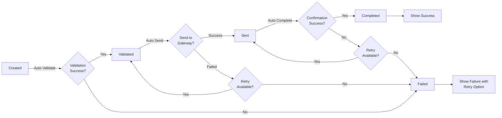

# Payment Processing Flow Design

## Overview

This document describes the complete payment processing flow design implemented in the Ctrl-Pay system. The design focuses on providing users with clear, real-time visual feedback about their payment's status as it progresses through the system.

## Payment Lifecycle States

The payment system uses the following states:

```
CREATED → VALIDATED → SENT → COMPLETED
                   ↓
                FAILED (can occur at any stage)
```

### State Descriptions

| State | Description | User Actions | Auto Transition |
|-------|-------------|---------------|-----------------|
| **CREATED** | Payment has been submitted but not yet validated | - | Auto validates |
| **VALIDATED** | Payment has passed all validation rules and is ready to be sent | - | Auto sends to gateway |
| **SENT** | Payment has been transmitted to the payment gateway | - | Auto completes |
| **COMPLETED** | Payment has been successfully processed and confirmed | Download receipt, view details | Terminal state |
| **FAILED** | Payment has failed at some stage in the process | Retry or mark as failed | Can retry |

## User Experience Flow

### 1. Payment Creation
- User fills in payment details (From Account, To Account, Amount, Currency)
- User reviews payment details
- User confirms and submits
- Payment is created with status `CREATED`
- User is redirected to the **Payment Processing** page

### 2. Automatic Processing
Once redirected to the Payment Processing page:



### 3. Processing Page Components

#### PaymentStatusFlow Component
Visual representation of payment progress:
- **Step-by-step visualization** showing current progress
- **Icons** indicating completed, in-progress, pending, or failed states
- **Real-time status messages** for each phase
- **Error details** if payment fails
- **Retry attempt counter** showing current retry attempt

#### Status Indicators
- ✓ **Green checkmark**: Completed step
- ⏳ **Hourglass**: Pending step
- 🔄 **Spinner**: Currently processing
- ✗ **Red X**: Failed step

### 4. Failure Handling & Retry

**Automatic Retry Logic:**
- Maximum 3 auto-retry attempts
- Triggered on send or completion failures (not validation failures)
- 2-second delay between retries
- Payment reverts to previous state before retry

**Manual Retry:**
- Users can manually retry after max retries exhausted
- Clicking "Retry Payment" button resets retry counter
- Payment transitions back to appropriate previous state

### 5. Success State
When payment reaches `COMPLETED`:
- Shows success message with green checkmark
- Displays "Download Receipt" button (placeholder)
- Option to return to payments list
- Shows payment summary and details

## Technical Implementation

### Frontend Components

#### 1. `CreatePayment.jsx` (Updated)
- Collects payment details from user
- Guides through 3-step process
- Creates payment via API
- **Redirects to**: `/payment/process/:id`

#### 2. `PaymentProcessing.jsx` (New)
**Main processing page that:**
- Fetches initial payment status
- Starts automatic workflow execution
- Handles state transitions (validate → send → complete)
- Manages error handling and retry logic
- Implements polling to check payment status
- Displays PaymentStatusFlow component

**Key Features:**
- Auto-transitions through workflow without user interaction
- Polling every 2 seconds for status updates
- Automatic retry with 3 max attempts
- Manual retry capability
- Real-time visual feedback

#### 3. `PaymentStatusFlow.jsx` (New)
**Visual component that displays:**
- 4-step stepper showing payment progression
- Current status and processing phase
- Icons for each step state
- Alert messages for current operation
- Retry attempt counter
- Detailed error information

### API Endpoints Used

| Method | Endpoint | Purpose |
|--------|----------|---------|
| POST | `/api/payments` | Create payment |
| GET | `/api/payments/{id}` | Get payment details |
| POST | `/api/payments/{id}/validate` | Validate payment (CREATED → VALIDATED) |
| POST | `/api/payments/{id}/send` | Send to gateway (VALIDATED → SENT) |
| POST | `/api/payments/{id}/complete` | Complete payment (SENT → COMPLETED) |
| POST | `/api/payments/{id}/fail` | Mark payment as failed |
| GET | `/api/payments/{id}/history` | Get status history |

### Processing Flow (Code Logic)

```javascript
// Simplified processing flow
async function processPaymentWorkflow(payment) {
  try {
    // Step 1: Validate
    if (payment.status === 'CREATED') {
      payment = await validatePayment(payment.id);
      if (failed) throw error;
    }

    // Step 2: Send
    if (payment.status === 'VALIDATED') {
      payment = await sendPayment(payment.id);
      if (failed && retries < 3) {
        await retry();
      }
    }

    // Step 3: Complete
    if (payment.status === 'SENT') {
      payment = await completePayment(payment.id);
      if (failed && retries < 3) {
        await retry();
      }
    }

    // Success!
    if (payment.status === 'COMPLETED') {
      showSuccessMessage();
    }
  } catch (error) {
    showErrorMessage(error);
    handleRetry();
  }
}
```

## State Management

### PaymentProcessing Component State
```javascript
{
  payment: {},              // Current payment object
  loading: boolean,         // Initial load state
  processingPhase: string,  // Current phase (validating/sending/completing)
  errorDetails: {},         // Error info {code, message}
  retryCount: number,       // Current retry attempt
  autoProcessing: boolean,  // Whether auto-workflow is active
}
```

## UI/UX Features

### Visual Feedback
1. **Progress Indication**: Step-by-step visualization with current progress
2. **Status Messages**: Clear, user-friendly messages for each phase
3. **Error Messages**: Detailed error information when failures occur
4. **Retry Feedback**: Shows retry attempt count
5. **Loading States**: Spinner during processing

### User Actions
1. **Automatic**: Most actions happen automatically
2. **Retry**: Manual retry button when max attempts exhausted
3. **Navigation**: Easy navigation back to payments list
4. **Download Receipt**: Download button for successful payments

## Error Scenarios

### Validation Failure
- Payment fails at validation stage
- Shows error message with details
- Option to return to payments list
- **No retry**: Validation failures are not retried

### Send Failure
- Payment fails to send to gateway
- Auto-retries up to 3 times
- If all retries fail, shows failure message
- Manual retry option available

### Completion Failure
- Payment sent but confirmation failed
- Auto-retries up to 3 times
- If all retries fail, shows failure message
- Manual retry option available

## Configuration

### Adjustable Parameters (in PaymentProcessing.jsx)

```javascript
const MAX_RETRIES = 3;                    // Maximum retry attempts
const POLLING_INTERVAL = 2000;            // 2 seconds between polls
const AUTO_TRANSITION_DELAY = 1500;       // 1.5 seconds before auto transition
```

## Navigation Routes

| Route | Component | Purpose |
|-------|-----------|---------|
| `/payments/create` | CreatePayment | Create new payment |
| `/payment/process/:id` | PaymentProcessing | Monitor payment processing |
| `/payments/:id` | PaymentDetail | View payment details (alternative) |
| `/payments` | PaymentsList | View all payments |

## Testing Scenarios

### Success Scenario
1. Create payment with valid details
2. Observe auto-progression through all states
3. Reach COMPLETED status
4. See success message and receipt option

### Failure Scenario (Send)
1. Create payment
2. Validation succeeds
3. Send fails (simulated 20% failure rate)
4. Auto-retries 3 times
5. Shows final failure message
6. Manual retry option available

### Manual Retry Scenario
1. Let payment fail naturally
2. Click "Retry Payment"
3. Retry counter resets
4. Payment attempts from previous state again
5. Can succeed or fail again

### Real-time Update Scenario
1. Create payment from one tab
2. Open payment processing in another tab
3. Polling updates status in real-time
4. Both tabs show synchronized status

## Benefits of This Design

✅ **Clear User Feedback**: Users always know payment status
✅ **Automatic Processing**: No user action needed after creation
✅ **Error Recovery**: Built-in retry logic with visual feedback
✅ **Real-time Updates**: Polling ensures status is always current
✅ **Professional UX**: Step-by-step visualization is intuitive
✅ **Failure Information**: Detailed error messages for debugging
✅ **Responsive**: Works on desktop and mobile devices

## Future Enhancements

1. **WebSocket Integration**: Replace polling with real-time WebSocket updates
2. **Progress Persistence**: Save processing state to local storage
3. **Email Notifications**: Send status updates to user email
4. **Advanced Analytics**: Track payment time at each stage
5. **Multi-language Support**: Localize status messages
6. **Mobile App Integration**: Native app payment tracking
7. **Webhook Callbacks**: External system notifications
8. **Payment Scheduling**: Schedule payments for later

