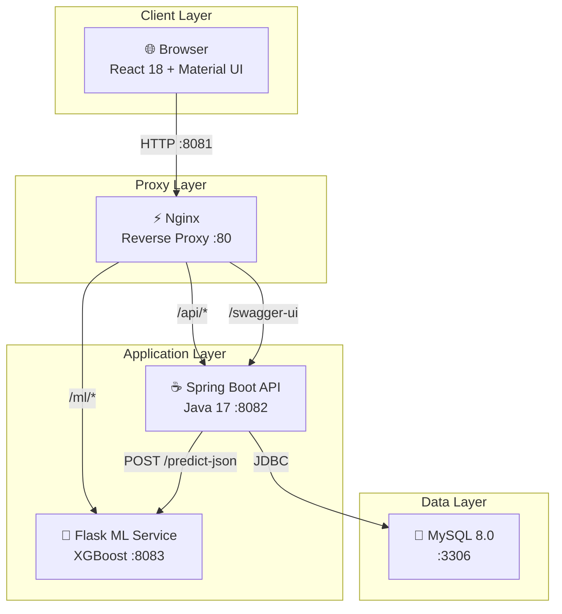
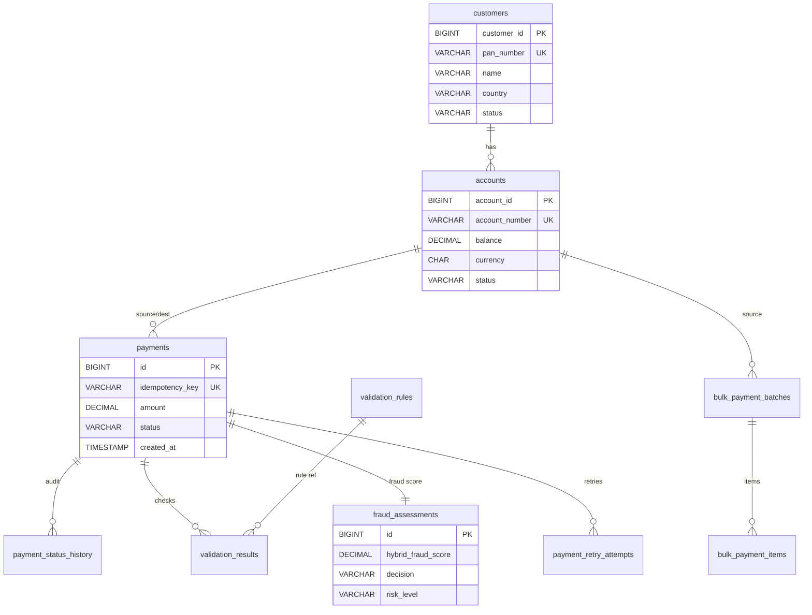
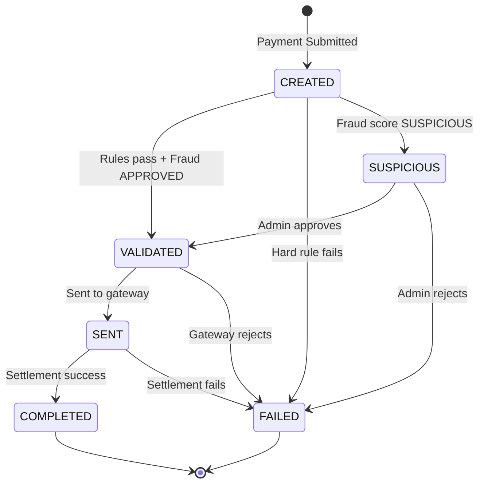
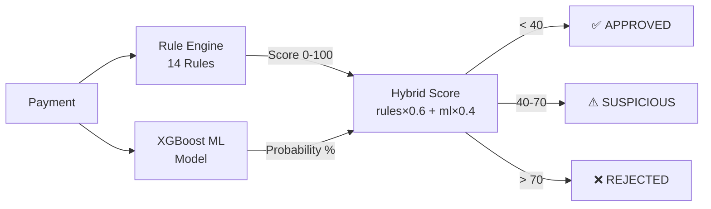
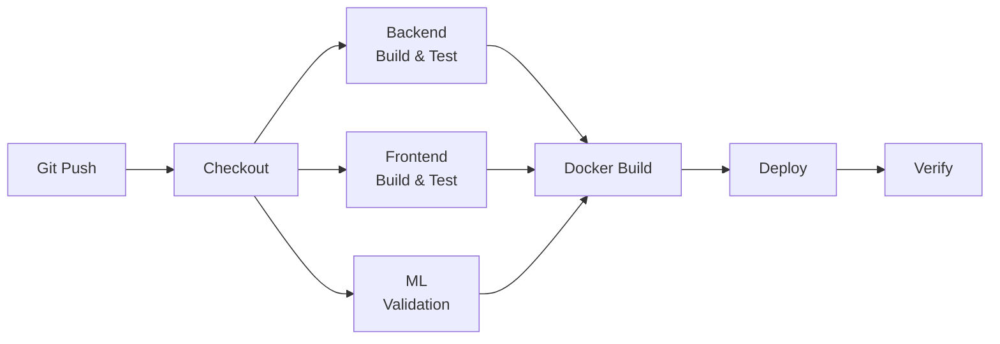

# 💳 Ctrl-Pay — Intelligent Payment Processing Platform

<div align="center">

**A full-stack payment processing system with real-time fraud detection, built with React, Spring Boot, MySQL, Flask ML, Docker Compose, and Jenkins CI/CD.**

[](https://openjdk.org/)
[](https://spring.io/projects/spring-boot)
[](https://react.dev/)
[](https://www.mysql.com/)
[](https://docs.docker.com/compose/)
[](https://www.jenkins.io/)
[](https://xgboost.readthedocs.io/)

</div>

---

## 📋 Table of Contents

- [Overview](#overview)
- [Architecture](#architecture)
- [Key Features](#key-features)
- [Tech Stack](#tech-stack)
- [Data Model](#data-model)
- [Quick Start (Docker Compose)](#quick-start-docker-compose)
- [Deployment Access (Linux VM)](#deployment-access-linux-vm)
- [Local Development](#local-development)
- [API Reference](#api-reference)
- [Fraud Detection Engine](#fraud-detection-engine)
- [Testing](#testing)
- [CI/CD Pipeline](#cicd-pipeline)
- [Project Structure](#project-structure)
- [Configuration](#configuration)
- [Troubleshooting](#troubleshooting)

---

## Overview

Ctrl-Pay is a comprehensive payment processing platform that manages the complete lifecycle of financial transactions with enterprise-grade fraud detection, audit compliance, and analytics.

### Core Capabilities

1. **Payment Lifecycle Management** — Create → Validate → Send → Complete/Fail with full audit trail
2. **Hybrid Fraud Detection** — 14 rule-based detectors + XGBoost ML model for real-time scoring
3. **Bulk Payment Processing** — CSV upload for batch payments with per-item validation
4. **Customer & Account Management** — PAN-based profiles, multi-account, PIN authentication
5. **Real-Time Analytics** — 7 interactive dashboards with live charts (Platform, Transaction, Fraud, Customer, ML Model, Bulk, Compliance)
6. **Admin Control Panels** — Configurable validation rules, fraud rules, and human review queues
7. **Settlement Engine** — Automated processing with cross-currency conversion, retry logic, and exponential backoff

---

## Architecture

### System Architecture Diagram



### Request Flow

```
Browser (:8081) → Nginx (reverse proxy) → Spring Boot API (:8082) → MySQL (:3306)
                                        → Flask ML Service (:8083)
```

| Layer | Component | Port | Responsibility |
|-------|-----------|------|---------------|
| Frontend | `ctrl-pay-frontend` | 8081 | Serves React UI through Nginx |
| Proxy | Nginx (inside frontend) | 80 | Proxies `/api`, `/ml`, `/actuator`, Swagger paths |
| Backend API | `ctrl-pay-backend` | 8082 | REST endpoints, business logic, fraud detection |
| ML Service | `ctrl-pay-ml` | 8083 | XGBoost fraud prediction inference |
| Database | `ctrl-pay-mysql` | 3306 | Persists all transactional data |
| CI/CD | Jenkins | 8080 | Automated build, test, deploy pipeline |

> 📘 For detailed architecture diagrams (sequence, activity, component, ER), see [`docs/ARCHITECTURE.md`](docs/ARCHITECTURE.md).

---

## Key Features

### 💰 Payment Processing
- Single payment creation with PIN-based authentication
- Idempotency key support to prevent duplicate payments
- Full payment lifecycle: `CREATED → VALIDATED → SENT → COMPLETED`
- Cross-currency payments with real-time exchange rates
- Payment receipt generation (PDF)

### 🔍 Fraud Detection (Hybrid AI)
- **14 rule-based fraud detectors** — velocity, large amounts, unusual time, account drain, cyclical patterns, behavioral baselines, cross-currency anomalies, and more
- **XGBoost ML model** — trained on financial fraud dataset with 9 features
- **Hybrid scoring** — weighted combination of rule engine + ML probability
- **Admin review queue** — suspicious payments held for human approval/rejection

### 📦 Bulk Payments
- CSV file upload for batch processing
- Per-item validation against all business rules
- Batch status tracking: `CREATED → VALIDATING → PROCESSING → COMPLETED`
- Partial completion support (some items succeed, others fail)

### 📊 Analytics Dashboards
- **Platform Overview** — total payments, success rate, volume trends
- **Transaction Dashboard** — status distribution, daily volumes, settlement metrics
- **Fraud Dashboard** — risk distribution, triggered rules, ML accuracy
- **Customer Analytics** — customer activity, account risk levels
- **ML Model Dashboard** — model performance metrics, prediction distribution

### ✅ Validation Engine
- Database-configurable validation rules (zero-downtime changes)
- 5 built-in rules: Amount Range, Account Format, Account Difference, Sufficient Funds, Mock Sufficient Funds
- HARD rules (block payment) vs SOFT rules (warning only)
- Dry-run testing for new rules before activation

### 🕵️ Compliance & Audit
- Immutable `payment_status_history` table records every state transition
- Fraud assessment audit trail with reviewer identity and notes
- `fraud_audit_events` for compliance reporting
- Complete validation result logging per payment

---

## Tech Stack

| Layer | Technology | Version | Purpose |
|-------|-----------|---------|---------|
| **Backend** | Java | 17 | Runtime language |
| **Backend** | Spring Boot | 4.0.7 | Application framework |
| **Backend** | Spring Web | Managed | REST controllers |
| **Backend** | Spring JDBC | Managed | Data access layer |
| **Backend** | MySQL Connector/J | Managed | JDBC driver |
| **Backend** | springdoc-openapi | 2.8.14 | Swagger UI + OpenAPI |
| **Frontend** | React | 18 | UI framework |
| **Frontend** | Material UI (MUI) | 5.14 | Component library |
| **Frontend** | Recharts | 2.8 | Data visualization |
| **Frontend** | Axios | 1.4 | HTTP client |
| **Frontend** | React Router | 6.14 | Client-side routing |
| **ML** | Flask | 3.x | Inference API server |
| **ML** | XGBoost | 2.x | Gradient boosted fraud classifier |
| **ML** | scikit-learn / pandas | 1.x | Feature engineering |
| **DevOps** | Docker / Docker Compose | Latest | Container orchestration |
| **DevOps** | Nginx | Alpine | Reverse proxy & static hosting |
| **DevOps** | Jenkins | Latest | CI/CD pipeline automation |

---

## Data Model

The database consists of **14 tables** organized across 4 domains:



### Domain Breakdown

| Domain | Tables | Purpose |
|--------|--------|---------|
| **Customer** | `customers`, `accounts` | Customer profiles (PAN-keyed), bank accounts with PIN auth |
| **Payment** | `payments`, `payment_status_history`, `validation_results`, `payment_retry_attempts` | Payment lifecycle, audit trail, rule results, retry tracking |
| **Fraud** | `fraud_assessments`, `fraud_account_risk`, `fraud_rules`, `fraud_audit_events`, `ml_models`, `ml_model_predictions` | Fraud scoring, risk escalation, rule config, ML tracking |
| **Bulk** | `bulk_payment_batches`, `bulk_payment_items` | Batch processing for CSV uploads |
| **Validation** | `validation_rules` | Configurable business rules |

> 📘 Full ER diagram with all columns: [`docs/ARCHITECTURE.md`](docs/ARCHITECTURE.md#data-model-er-diagram)

---

## Quick Start (Docker Compose)

```bash
# Clone the repository
git clone <repo-url>
cd 108_05_ctrl_pay

# Start all services
docker compose up --build
```

Services started:

| Service | Container Name | Port |
|---------|---------------|------|
| MySQL | `ctrl-pay-mysql` | 3306 (internal) |
| ML Service | `ctrl-pay-ml` | 8083 (internal) |
| Backend API | `ctrl-pay-backend` | 8082 (internal) |
| Frontend + Nginx | `ctrl-pay-frontend` | **8081** (public) |

### Access Points

| Resource | URL |
|----------|-----|
| 🌐 Frontend | `http://localhost:8081` |
| 📡 API Base | `http://localhost:8081/api/payments` |
| 📖 Swagger UI | `http://localhost:8081/swagger-ui/index.html` |
| 📝 OpenAPI JSON | `http://localhost:8081/v3/api-docs` |

### Stop Services

```bash
docker compose down          # Stop containers
docker compose down -v       # Stop + remove volumes (fresh DB)
```

---

## Deployment Access (Linux VM)

After deployment to the Linux VM:

```
VM IP: 10.9.72.215
```

| Resource | URL |
|----------|-----|
| Frontend | `http://10.9.64.156:8081` |
| Swagger UI | `http://10.9.64.156:8081/swagger-ui/index.html` |
| Jenkins | `http://10.9.64.156:8080` |

---

## Local Development

### Prerequisites

- Java 17+
- Maven 3.9+ (or use included `mvnw`)
- Node.js 20+
- Python 3.11+
- MySQL 8.0+

### 1. Start MySQL

```sql
CREATE DATABASE ctrl_pay;
```

### 2. Run Backend

```bash
cd backend
./mvnw spring-boot:run -Dspring-boot.run.arguments="--spring.profiles.active=dev"
```

### 3. Run Frontend

```bash
cd frontend
npm install
npm start
```

### 4. Run ML Service

```bash
cd ml_fraud-detection/payment-fraud-detection-main
pip install -r requirements.txt
flask --app app run --host=0.0.0.0 --port=8083
```

---

## API Reference

### Payment APIs

| Method | Endpoint | Description |
|--------|----------|-------------|
| `POST` | `/api/payments` | Create new payment |
| `GET` | `/api/payments/{id}` | Get payment by ID |
| `GET` | `/api/payments` | List payments (with filtering & pagination) |
| `POST` | `/api/payments/{id}/validate` | Transition CREATED → VALIDATED |
| `POST` | `/api/payments/{id}/send` | Transition VALIDATED → SENT |
| `POST` | `/api/payments/{id}/complete` | Transition SENT → COMPLETED |
| `POST` | `/api/payments/{id}/fail` | Manually fail a payment |

### Audit & History APIs

| Method | Endpoint | Description |
|--------|----------|-------------|
| `GET` | `/api/payments/{id}/audit` | Full audit trail |
| `GET` | `/api/payments/{id}/audit/status-history` | Status transition history |
| `GET` | `/api/payments/{id}/audit/validations` | Validation results |

### Customer & Account APIs

| Method | Endpoint | Description |
|--------|----------|-------------|
| `POST` | `/api/customers` | Create customer (PAN validation) |
| `GET` | `/api/customers/{id}` | Get customer details |
| `POST` | `/api/customers/{id}/accounts` | Create bank account |
| `GET` | `/api/customers/{id}/accounts` | List customer accounts |
| `GET` | `/api/customers/{id}/profile` | Full customer profile |
| `GET` | `/api/customers/{id}/profile/risk` | Customer risk information |
| `GET` | `/api/customers/{id}/statistics` | Payment statistics |

### Bulk Payment APIs

| Method | Endpoint | Description |
|--------|----------|-------------|
| `POST` | `/api/bulk-payments/upload` | Upload CSV batch |
| `GET` | `/api/bulk-payments/{batchId}` | Get batch status |
| `GET` | `/api/bulk-payments` | List all batches |

### Fraud Admin APIs

| Method | Endpoint | Description |
|--------|----------|-------------|
| `GET` | `/api/admin/fraud/pending` | Get pending review queue |
| `GET` | `/api/admin/fraud/payment/{id}` | Get fraud investigation details |
| `POST` | `/api/admin/fraud/payment/{id}/approve` | Approve suspicious payment |
| `POST` | `/api/admin/fraud/payment/{id}/reject` | Reject suspicious payment |
| `GET` | `/api/admin/fraud/stats` | Fraud statistics |

### Validation Rule Admin APIs

| Method | Endpoint | Description |
|--------|----------|-------------|
| `GET` | `/api/admin/validation-rules` | List all rules |
| `POST` | `/api/admin/validation-rules` | Create new rule |
| `PUT` | `/api/admin/validation-rules/{id}` | Update rule |
| `PATCH` | `/api/admin/validation-rules/{id}/toggle` | Toggle rule active/inactive |
| `POST` | `/api/admin/validation-rules/{id}/test-dry-run` | Test rule without saving |

### Analytics Dashboard APIs

| Method | Endpoint | Description |
|--------|----------|-------------|
| `GET` | `/api/dashboard/overview` | Platform overview |
| `GET` | `/api/dashboard/transactions` | Transaction metrics |
| `GET` | `/api/dashboard/fraud` | Fraud & risk metrics |
| `GET` | `/api/dashboard/customers` | Customer analytics |
| `GET` | `/api/dashboard/bulk-payments` | Bulk payment analytics |
| `GET` | `/api/dashboard/ml` | ML model performance |
| `GET` | `/api/dashboard/compliance` | Compliance metrics |

### ML Inference API

| Method | Endpoint | Description |
|--------|----------|-------------|
| `POST` | `/predict-json` | XGBoost fraud probability scoring |

---

## Fraud Detection Engine

### Payment Lifecycle State Machine



### Hybrid Scoring Architecture



### Fraud Rules

| # | Rule | Detection Target |
|---|------|-----------------|
| 1 | TransactionVelocityRule | High transaction frequency |
| 2 | LargeTransactionRule | Unusually large amounts |
| 3 | ExtremelyLargeTransactionRule | Extreme outlier amounts |
| 4 | CrossCurrencyRule | Unusual currency conversions |
| 5 | NewDestinationRule | First-time destination accounts |
| 6 | UnusualTimePatternRule | Transactions at unusual hours |
| 7 | AccountDrainRule | Account balance drain patterns |
| 8 | BehavioralBaselineRule | Deviation from normal behavior |
| 9 | BehaviorChangeRule | Sudden behavior shifts |
| 10 | CyclicalTransactionPatternRule | Circular money movement |
| 11 | VelocityAnomalyRule | Velocity spike detection |
| 12 | MultipleFailureRule | Repeated failed attempts |
| 13 | SuspiciousAccountRule | Previously flagged accounts |
| 14 | ContextualRiskAggregationRule | Cross-rule risk aggregation |
| 15 | MLFraudRule | XGBoost model inference |

---

## Testing

### Run Backend Tests

```bash
cd backend
./mvnw test                  # Run all 319 unit tests
./mvnw verify                # Run tests + generate JaCoCo report
```

### Test Coverage

- **76 test classes** covering controllers, services, fraud rules, validation, scheduling, and exception handling
- **319 unit tests** — all passing
- **JaCoCo** code coverage reports generated at `backend/target/site/jacoco/`

### Frontend

```bash
cd frontend
npm test                     # Run React component tests
npm run build                # Build production bundle
```

### ML Service Validation

```bash
cd ml_fraud-detection/payment-fraud-detection-main
pip install -r requirements.txt
python -u -c "import pickle, xgboost, sklearn, numpy, pandas"
```

---

## CI/CD Pipeline

### Jenkins Pipeline



**Pipeline stages** (defined in `Jenkinsfile`):

1. **Checkout Source** — Pull latest code
2. **Backend Build & Test** — `mvnw test` + `mvnw package`
3. **Frontend Build & Test** — `npm install` + `npm test` + `npm run build`
4. **ML Validation** — Install dependencies, verify model loading
5. **Stop Existing Containers** — `docker-compose down`
6. **Build Docker Images** — `docker-compose build --no-cache`
7. **Deploy** — `docker-compose up -d`
8. **Verify** — Check all containers are running

---

## Project Structure

```
108_05_ctrl_pay/
├── backend/                                    # Spring Boot application
│   ├── src/main/java/com/neueda/
│   │   ├── controller/                         # 14 REST controllers
│   │   │   ├── PaymentController.java
│   │   │   ├── PaymentLifecycleController.java
│   │   │   ├── CustomerController.java
│   │   │   ├── AccountController.java
│   │   │   ├── BulkPaymentController.java
│   │   │   ├── FraudAdminController.java
│   │   │   ├── AnalyticsController.java
│   │   │   └── ...
│   │   ├── service/                            # 18 service classes
│   │   │   ├── PaymentService.java
│   │   │   ├── PaymentSettlementService.java
│   │   │   ├── FraudRiskService.java
│   │   │   ├── CustomerProfileService.java
│   │   │   ├── AnalyticsService.java
│   │   │   └── bulk/BulkPaymentService.java
│   │   ├── domain/                             # 24 domain models (Java Records)
│   │   ├── dto/                                # Request/Response DTOs
│   │   ├── fraud/rules/                        # 14 fraud rules + engine
│   │   ├── validation/rules/                   # 5 validation rule implementations
│   │   ├── repository/                         # Repository interfaces
│   │   ├── repository/impl/                    # 14 JDBC repository implementations
│   │   ├── exception/                          # Custom exceptions + GlobalExceptionHandler
│   │   └── scheduler/                          # Payment + Bulk processor schedulers
│   ├── src/main/resources/
│   │   └── schema.sql                          # Database schema (14 tables + seed data)
│   └── src/test/java/com/neueda/               # 76 test classes (319 tests)
│
├── frontend/                                   # React application
│   ├── src/
│   │   ├── pages/                              # 25 page components
│   │   ├── components/                         # 11 reusable components
│   │   ├── services/api.js                     # API client (axios)
│   │   ├── context/                            # Customer + Theme providers
│   │   └── theme/                              # MUI theme configuration
│   ├── nginx.conf                              # Reverse proxy configuration
│   └── Dockerfile                              # Frontend container image
│
├── ml_fraud-detection/                         # Python ML service
│   └── payment-fraud-detection-main/
│       ├── app.py                              # Flask API (predict, predict-json)
│       ├── XGBoostModel.pkl                    # Trained XGBoost model
│       ├── notebook/                           # Training Jupyter notebook
│       └── Dockerfile                          # ML container image
│
├── docs/                                       # Documentation
│   ├── ARCHITECTURE.md                         # Architecture & design diagrams
│   ├── LINUX_JENKINS_DEPLOYMENT.md             # VM deployment guide
│   └── postman/                                # Postman collections
│
├── docker-compose.yml                          # Multi-service orchestration
├── Jenkinsfile                                 # CI/CD pipeline definition
└── README.md                                   # This file
```

---

## Configuration

### Configuration Files

| File | Purpose |
|------|---------|
| `backend/src/main/resources/application.properties` | Base config |
| `backend/src/main/resources/application-dev.properties` | Local development |
| `backend/src/main/resources/application-docker.properties` | Docker environment |
| `frontend/src/services/api.js` | API base URL configuration |
| `frontend/nginx.conf` | Nginx reverse proxy rules |
| `docker-compose.yml` | Service definitions and networking |
| `.env.example` | Environment variable template |

### Key Settings

- `spring.sql.init.mode=always` — loads `schema.sql` on startup
- Docker backend: port `8082`, ML service: port `8083`
- Nginx proxies `/api`, `/ml`, `/actuator`, and Swagger routes
- MySQL persistent volume: `mysql_data`

---

## Troubleshooting

| Problem | Solution |
|---------|----------|
| Frontend cannot reach backend | Confirm Nginx is proxying `/api` to `backend:8082` and the React app uses `/api` as base URL |
| CORS errors | Nginx handles preflight; check `nginx.conf` proxy headers |
| Backend connection failed | Ensure backend is running on `8082` and MySQL is healthy |
| ML service errors | Verify `XGBoostModel.pkl` exists and Flask is running on `8083` |
| Port conflict | Frontend: `8081`, Jenkins: `8080`, Backend/ML stay internal |
| Database schema issues | Run `docker compose down -v` for a fresh database |
| Tests failing | Run `./mvnw clean test` from `backend/` directory |

---

## Project Statistics

| Metric | Count |
|--------|-------|
| Backend Java classes | 175 |
| Backend test classes | 76 |
| Unit tests | 319 (all passing) |
| REST controllers | 14 |
| Service classes | 18 |
| Fraud detection rules | 14 + 1 ML model |
| Validation rules | 5 (DB-configurable) |
| Database tables | 14 |
| React components (JSX) | 38 |
| Frontend pages | 25 |
| API endpoints | 50+ |
| Docker services | 4 |

---

<div align="center">

**Built with ❤️ by the Ctrl-Pay Team @ Neueda Academy — August 2026**

</div>
