# Ctrl-Pay Architecture & Design

> Comprehensive technical documentation for the Ctrl-Pay Payment Processing Platform.

---

## Table of Contents

- [System Architecture](#system-architecture)
- [Data Model (ER Diagram)](#data-model-er-diagram)
- [Payment Lifecycle State Machine](#payment-lifecycle-state-machine)
- [Sequence Diagrams](#sequence-diagrams)
  - [Create Payment Flow](#1-create-payment-flow)
  - [Fraud Detection Flow](#2-fraud-detection-flow)
  - [Settlement Flow](#3-settlement-flow)
  - [Bulk Payment Flow](#4-bulk-payment-csv-upload-flow)
  - [Admin Fraud Review Flow](#5-admin-fraud-review-flow)
- [Activity Diagrams](#activity-diagrams)
  - [Payment Processing Activity](#1-payment-processing-activity)
  - [Fraud Scoring Activity](#2-fraud-scoring-activity)
  - [Bulk Payment Processing Activity](#3-bulk-payment-processing-activity)
- [Component Diagram](#component-diagram)
- [CI/CD Pipeline](#cicd-pipeline)
- [Deployment Architecture](#deployment-architecture)

---

## System Architecture

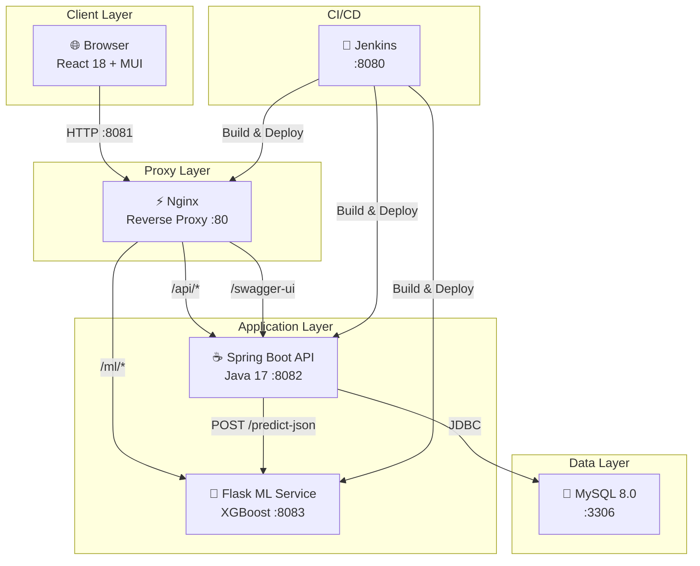
```mermaid
graph TB
    subgraph "Client Layer"
        Browser["🌐 Browser<br/>React 18 + MUI"]
    end

    subgraph "Proxy Layer"
        Nginx["⚡ Nginx<br/>Reverse Proxy :80"]
    end

    subgraph "Application Layer"
        Backend["☕ Spring Boot API<br/>Java 17 :8082"]
        ML["🐍 Flask ML Service<br/>XGBoost :8083"]
    end

    subgraph "Data Layer"
        MySQL["🐬 MySQL 8.0<br/>:3306"]
    end

    subgraph "CI/CD"
        Jenkins["🔧 Jenkins<br/>:8080"]
    end

    Browser -->|"HTTP :8081"| Nginx
    Nginx -->|"/api/*"| Backend
    Nginx -->|"/ml/*"| ML
    Nginx -->|"/swagger-ui"| Backend
    Backend -->|"JDBC"| MySQL
    Backend -->|"POST /predict-json"| ML
    Jenkins -->|"Build & Deploy"| Backend
    Jenkins -->|"Build & Deploy"| ML
    Jenkins -->|"Build & Deploy"| Nginx
```

### Request Flow

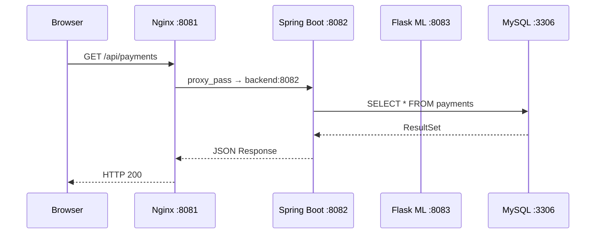
```mermaid
sequenceDiagram
    participant B as Browser
    participant N as Nginx :8081
    participant API as Spring Boot :8082
    participant ML as Flask ML :8083
    participant DB as MySQL :3306

    B->>N: GET /api/payments
    N->>API: proxy_pass → backend:8082
    API->>DB: SELECT * FROM payments
    DB-->>API: ResultSet
    API-->>N: JSON Response
    N-->>B: HTTP 200
```

---

## Data Model (ER Diagram)

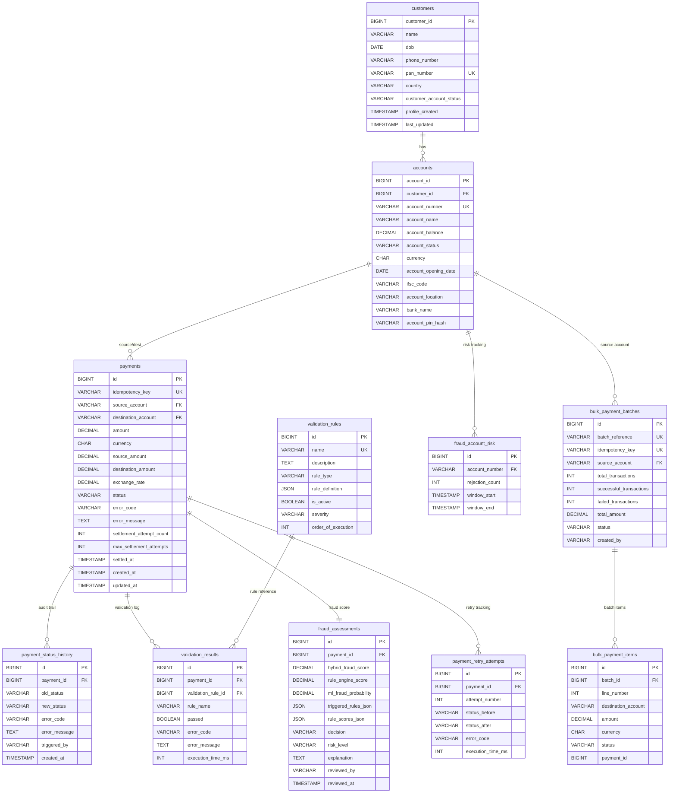
```mermaid
erDiagram
    customers ||--o{ accounts : "has"
    accounts ||--o{ payments : "source/dest"
    payments ||--o{ payment_status_history : "audit trail"
    payments ||--o{ validation_results : "validation log"
    payments ||--|| fraud_assessments : "fraud score"
    payments ||--o{ payment_retry_attempts : "retry tracking"
    validation_rules ||--o{ validation_results : "rule reference"
    accounts ||--o{ fraud_account_risk : "risk tracking"
    accounts ||--o{ bulk_payment_batches : "source account"
    bulk_payment_batches ||--o{ bulk_payment_items : "batch items"

    customers {
        BIGINT customer_id PK
        VARCHAR name
        DATE dob
        VARCHAR phone_number
        VARCHAR pan_number UK
        VARCHAR country
        VARCHAR customer_account_status
        TIMESTAMP profile_created
        TIMESTAMP last_updated
    }

    accounts {
        BIGINT account_id PK
        BIGINT customer_id FK
        VARCHAR account_number UK
        VARCHAR account_name
        DECIMAL account_balance
        VARCHAR account_status
        CHAR currency
        DATE account_opening_date
        VARCHAR ifsc_code
        VARCHAR account_location
        VARCHAR bank_name
        VARCHAR account_pin_hash
    }

    payments {
        BIGINT id PK
        VARCHAR idempotency_key UK
        VARCHAR source_account FK
        VARCHAR destination_account FK
        DECIMAL amount
        CHAR currency
        DECIMAL source_amount
        DECIMAL destination_amount
        DECIMAL exchange_rate
        VARCHAR status
        VARCHAR error_code
        TEXT error_message
        INT settlement_attempt_count
        INT max_settlement_attempts
        TIMESTAMP settled_at
        TIMESTAMP created_at
        TIMESTAMP updated_at
    }

    payment_status_history {
        BIGINT id PK
        BIGINT payment_id FK
        VARCHAR old_status
        VARCHAR new_status
        VARCHAR error_code
        TEXT error_message
        VARCHAR triggered_by
        TIMESTAMP created_at
    }

    validation_rules {
        BIGINT id PK
        VARCHAR name UK
        TEXT description
        VARCHAR rule_type
        JSON rule_definition
        BOOLEAN is_active
        VARCHAR severity
        INT order_of_execution
    }

    validation_results {
        BIGINT id PK
        BIGINT payment_id FK
        BIGINT validation_rule_id FK
        VARCHAR rule_name
        BOOLEAN passed
        VARCHAR error_code
        TEXT error_message
        INT execution_time_ms
    }

    fraud_assessments {
        BIGINT id PK
        BIGINT payment_id FK
        DECIMAL hybrid_fraud_score
        DECIMAL rule_engine_score
        DECIMAL ml_fraud_probability
        JSON triggered_rules_json
        JSON rule_scores_json
        VARCHAR decision
        VARCHAR risk_level
        TEXT explanation
        VARCHAR reviewed_by
        TIMESTAMP reviewed_at
    }

    payment_retry_attempts {
        BIGINT id PK
        BIGINT payment_id FK
        INT attempt_number
        VARCHAR status_before
        VARCHAR status_after
        VARCHAR error_code
        INT execution_time_ms
    }

    fraud_account_risk {
        BIGINT id PK
        VARCHAR account_number FK
        INT rejection_count
        TIMESTAMP window_start
        TIMESTAMP window_end
    }

    bulk_payment_batches {
        BIGINT id PK
        VARCHAR batch_reference UK
        VARCHAR idempotency_key UK
        VARCHAR source_account FK
        INT total_transactions
        INT successful_transactions
        INT failed_transactions
        DECIMAL total_amount
        VARCHAR status
        VARCHAR created_by
    }

    bulk_payment_items {
        BIGINT id PK
        BIGINT batch_id FK
        INT line_number
        VARCHAR destination_account
        DECIMAL amount
        CHAR currency
        VARCHAR status
        BIGINT payment_id
    }
```

---

## Payment Processing Flow

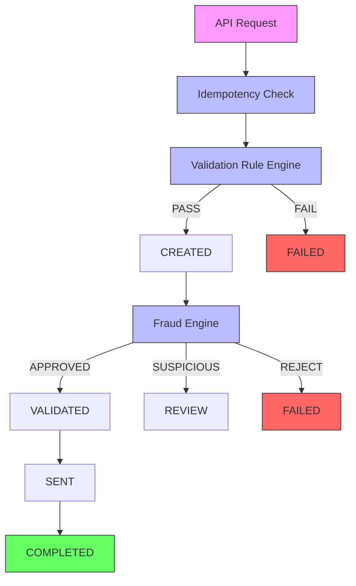
```mermaid
flowchart TD

    A[API Request] --> B[Idempotency Check]

    B --> C[Validation Rule Engine]

    C -->|PASS| D[CREATED]
    C -->|FAIL| E[FAILED]

    D --> F[Fraud Engine]

    F -->|APPROVED| G[VALIDATED]
    F -->|SUSPICIOUS| H[REVIEW]
    F -->|REJECT| I[FAILED]

    G --> J[SENT]

    J --> K[COMPLETED]


    style A fill:#f9f,stroke:#333
    style B fill:#bbf,stroke:#333
    style C fill:#bbf,stroke:#333
    style F fill:#bbf,stroke:#333
    style E fill:#f66,stroke:#333
    style I fill:#f66,stroke:#333
    style K fill:#6f6,stroke:#333
```

---

## Sequence Diagrams

### 1. Create Payment Flow

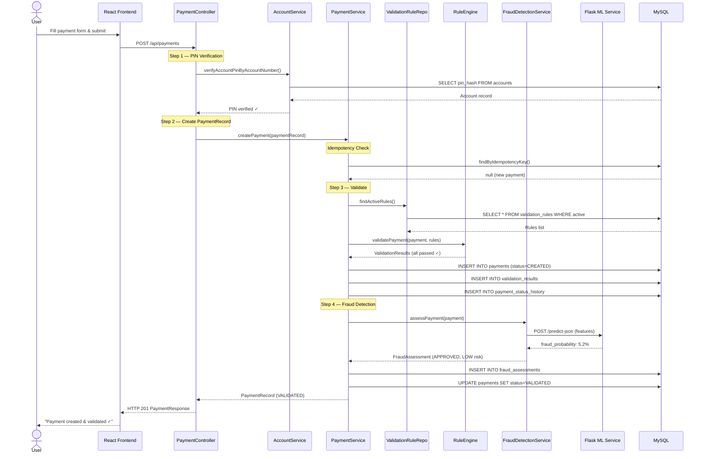
```mermaid
sequenceDiagram
    actor User
    participant UI as React Frontend
    participant API as PaymentController
    participant AS as AccountService
    participant PS as PaymentService
    participant VR as ValidationRuleRepo
    participant RE as RuleEngine
    participant FD as FraudDetectionService
    participant ML as Flask ML Service
    participant DB as MySQL

    User->>UI: Fill payment form & submit
    UI->>API: POST /api/payments
    
    Note over API: Step 1 — PIN Verification
    API->>AS: verifyAccountPinByAccountNumber()
    AS->>DB: SELECT pin_hash FROM accounts
    DB-->>AS: Account record
    AS-->>API: PIN verified ✓

    Note over API: Step 2 — Create PaymentRecord
    API->>PS: createPayment(paymentRecord)
    
    Note over PS: Idempotency Check
    PS->>DB: findByIdempotencyKey()
    DB-->>PS: null (new payment)

    Note over PS: Step 3 — Validate
    PS->>VR: findActiveRules()
    VR->>DB: SELECT * FROM validation_rules WHERE active
    DB-->>VR: Rules list
    PS->>RE: validatePayment(payment, rules)
    RE-->>PS: ValidationResults (all passed ✓)
    PS->>DB: INSERT INTO payments (status=CREATED)
    PS->>DB: INSERT INTO validation_results
    PS->>DB: INSERT INTO payment_status_history

    Note over PS: Step 4 — Fraud Detection
    PS->>FD: assessPayment(payment)
    FD->>ML: POST /predict-json (features)
    ML-->>FD: fraud_probability: 5.2%
    FD-->>PS: FraudAssessment (APPROVED, LOW risk)
    PS->>DB: INSERT INTO fraud_assessments
    PS->>DB: UPDATE payments SET status=VALIDATED

    PS-->>API: PaymentRecord (VALIDATED)
    API-->>UI: HTTP 201 PaymentResponse
    UI-->>User: "Payment created & validated ✓"
```

### 2. Fraud Detection Flow

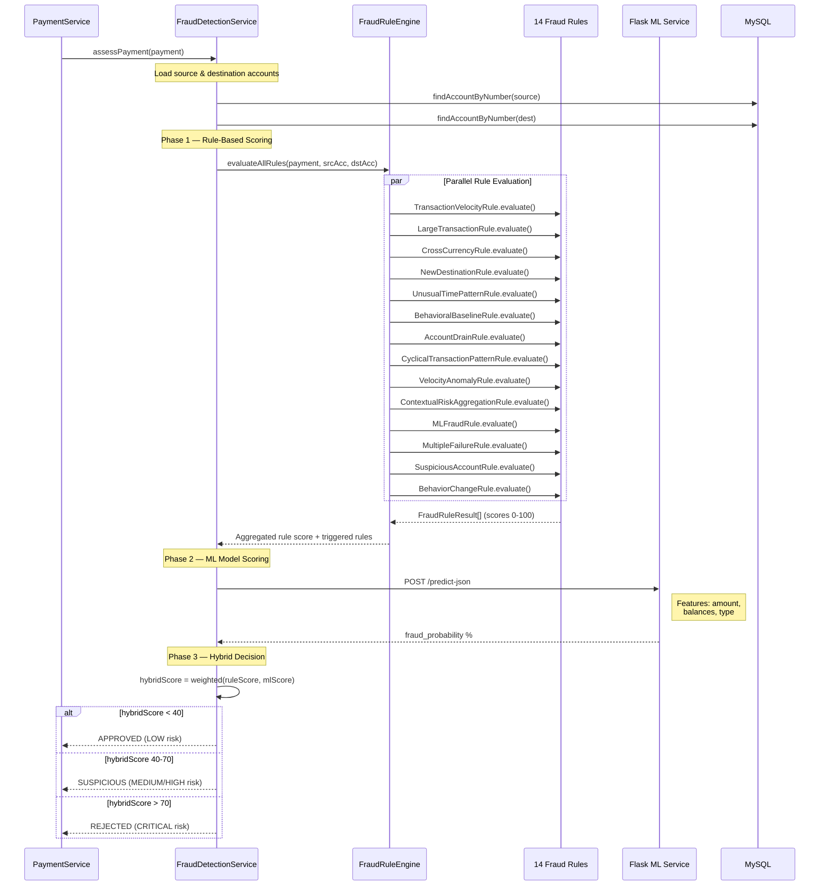
```mermaid
sequenceDiagram
    participant PS as PaymentService
    participant FD as FraudDetectionService
    participant FRE as FraudRuleEngine
    participant Rules as 14 Fraud Rules
    participant ML as Flask ML Service
    participant DB as MySQL

    PS->>FD: assessPayment(payment)
    
    Note over FD: Load source & destination accounts
    FD->>DB: findAccountByNumber(source)
    FD->>DB: findAccountByNumber(dest)

    Note over FD: Phase 1 — Rule-Based Scoring
    FD->>FRE: evaluateAllRules(payment, srcAcc, dstAcc)
    
    par Parallel Rule Evaluation
        FRE->>Rules: TransactionVelocityRule.evaluate()
        FRE->>Rules: LargeTransactionRule.evaluate()
        FRE->>Rules: CrossCurrencyRule.evaluate()
        FRE->>Rules: NewDestinationRule.evaluate()
        FRE->>Rules: UnusualTimePatternRule.evaluate()
        FRE->>Rules: BehavioralBaselineRule.evaluate()
        FRE->>Rules: AccountDrainRule.evaluate()
        FRE->>Rules: CyclicalTransactionPatternRule.evaluate()
        FRE->>Rules: VelocityAnomalyRule.evaluate()
        FRE->>Rules: ContextualRiskAggregationRule.evaluate()
        FRE->>Rules: MLFraudRule.evaluate()
        FRE->>Rules: MultipleFailureRule.evaluate()
        FRE->>Rules: SuspiciousAccountRule.evaluate()
        FRE->>Rules: BehaviorChangeRule.evaluate()
    end
    
    Rules-->>FRE: FraudRuleResult[] (scores 0-100)
    FRE-->>FD: Aggregated rule score + triggered rules

    Note over FD: Phase 2 — ML Model Scoring
    FD->>ML: POST /predict-json
    Note right of ML: Features: amount,<br/>balances, type
    ML-->>FD: fraud_probability %

    Note over FD: Phase 3 — Hybrid Decision
    FD->>FD: hybridScore = weighted(ruleScore, mlScore)
    
    alt hybridScore < 40
        FD-->>PS: APPROVED (LOW risk)
    else hybridScore 40-70
        FD-->>PS: SUSPICIOUS (MEDIUM/HIGH risk)
    else hybridScore > 70
        FD-->>PS: REJECTED (CRITICAL risk)
    end
```

### 3. Settlement Flow

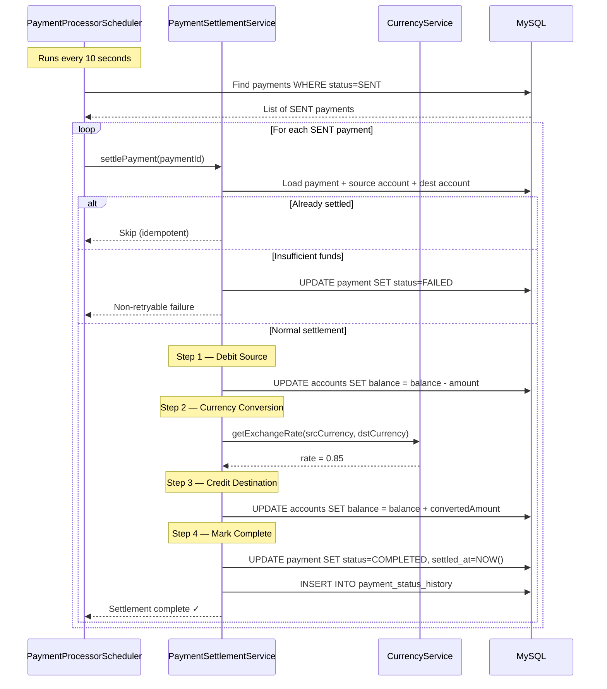
```mermaid
sequenceDiagram
    participant Sched as PaymentProcessorScheduler
    participant SS as PaymentSettlementService
    participant CS as CurrencyService
    participant DB as MySQL

    Note over Sched: Runs every 10 seconds
    Sched->>DB: Find payments WHERE status=SENT
    DB-->>Sched: List of SENT payments

    loop For each SENT payment
        Sched->>SS: settlePayment(paymentId)
        
        SS->>DB: Load payment + source account + dest account
        
        alt Already settled
            SS-->>Sched: Skip (idempotent)
        else Insufficient funds
            SS->>DB: UPDATE payment SET status=FAILED
            SS-->>Sched: Non-retryable failure
        else Normal settlement
            Note over SS: Step 1 — Debit Source
            SS->>DB: UPDATE accounts SET balance = balance - amount
            
            Note over SS: Step 2 — Currency Conversion
            SS->>CS: getExchangeRate(srcCurrency, dstCurrency)
            CS-->>SS: rate = 0.85
            
            Note over SS: Step 3 — Credit Destination
            SS->>DB: UPDATE accounts SET balance = balance + convertedAmount
            
            Note over SS: Step 4 — Mark Complete
            SS->>DB: UPDATE payment SET status=COMPLETED, settled_at=NOW()
            SS->>DB: INSERT INTO payment_status_history
            SS-->>Sched: Settlement complete ✓
        end
    end
```

### 4. Bulk Payment CSV Upload Flow

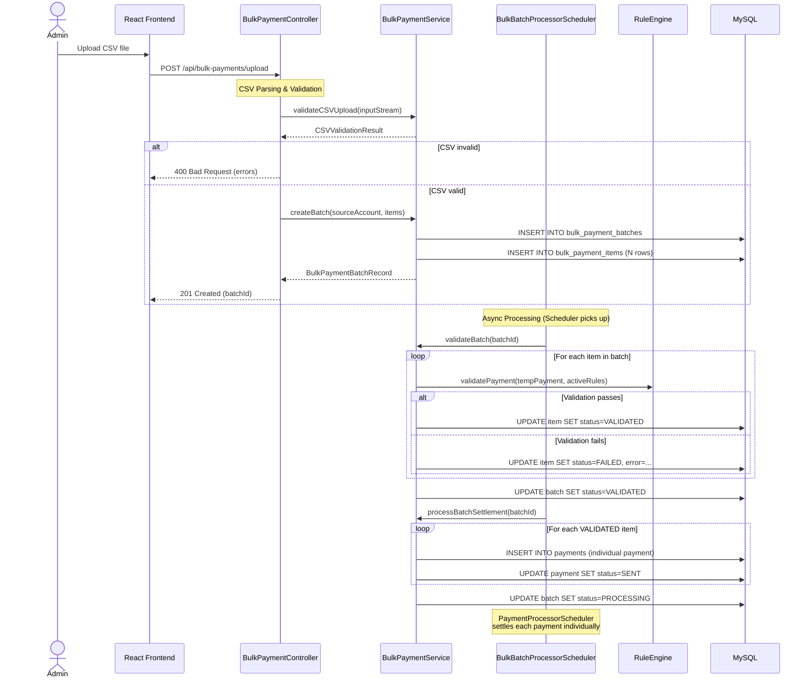
```mermaid
sequenceDiagram
    actor Admin
    participant UI as React Frontend
    participant API as BulkPaymentController
    participant BPS as BulkPaymentService
    participant Sched as BulkBatchProcessorScheduler
    participant RE as RuleEngine
    participant DB as MySQL

    Admin->>UI: Upload CSV file
    UI->>API: POST /api/bulk-payments/upload
    
    Note over API: CSV Parsing & Validation
    API->>BPS: validateCSVUpload(inputStream)
    BPS-->>API: CSVValidationResult
    
    alt CSV invalid
        API-->>UI: 400 Bad Request (errors)
    else CSV valid
        API->>BPS: createBatch(sourceAccount, items)
        BPS->>DB: INSERT INTO bulk_payment_batches
        BPS->>DB: INSERT INTO bulk_payment_items (N rows)
        BPS-->>API: BulkPaymentBatchRecord
        API-->>UI: 201 Created (batchId)
    end

    Note over Sched: Async Processing (Scheduler picks up)
    
    Sched->>BPS: validateBatch(batchId)
    loop For each item in batch
        BPS->>RE: validatePayment(tempPayment, activeRules)
        alt Validation passes
            BPS->>DB: UPDATE item SET status=VALIDATED
        else Validation fails
            BPS->>DB: UPDATE item SET status=FAILED, error=...
        end
    end
    BPS->>DB: UPDATE batch SET status=VALIDATED

    Sched->>BPS: processBatchSettlement(batchId)
    loop For each VALIDATED item
        BPS->>DB: INSERT INTO payments (individual payment)
        BPS->>DB: UPDATE payment SET status=SENT
    end
    BPS->>DB: UPDATE batch SET status=PROCESSING

    Note over Sched: PaymentProcessorScheduler<br/>settles each payment individually
```

### 5. Admin Fraud Review Flow

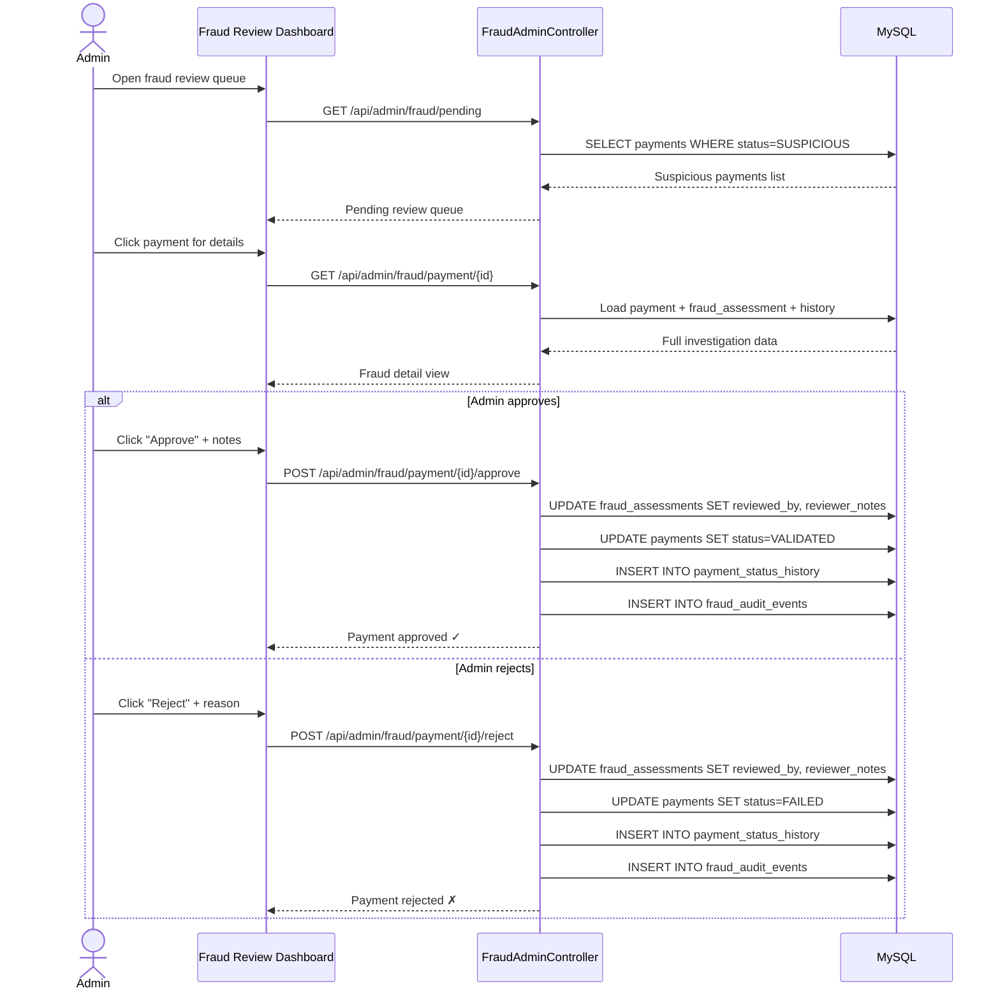
```mermaid
sequenceDiagram
    actor Admin
    participant UI as Fraud Review Dashboard
    participant API as FraudAdminController
    participant DB as MySQL

    Admin->>UI: Open fraud review queue
    UI->>API: GET /api/admin/fraud/pending
    API->>DB: SELECT payments WHERE status=SUSPICIOUS
    DB-->>API: Suspicious payments list
    API-->>UI: Pending review queue

    Admin->>UI: Click payment for details
    UI->>API: GET /api/admin/fraud/payment/{id}
    API->>DB: Load payment + fraud_assessment + history
    DB-->>API: Full investigation data
    API-->>UI: Fraud detail view

    alt Admin approves
        Admin->>UI: Click "Approve" + notes
        UI->>API: POST /api/admin/fraud/payment/{id}/approve
        API->>DB: UPDATE fraud_assessments SET reviewed_by, reviewer_notes
        API->>DB: UPDATE payments SET status=VALIDATED
        API->>DB: INSERT INTO payment_status_history
        API->>DB: INSERT INTO fraud_audit_events
        API-->>UI: Payment approved ✓
    else Admin rejects
        Admin->>UI: Click "Reject" + reason
        UI->>API: POST /api/admin/fraud/payment/{id}/reject
        API->>DB: UPDATE fraud_assessments SET reviewed_by, reviewer_notes
        API->>DB: UPDATE payments SET status=FAILED
        API->>DB: INSERT INTO payment_status_history
        API->>DB: INSERT INTO fraud_audit_events
        API-->>UI: Payment rejected ✗
    end
```

---

## Activity Diagrams

### 1. Payment Processing Activity

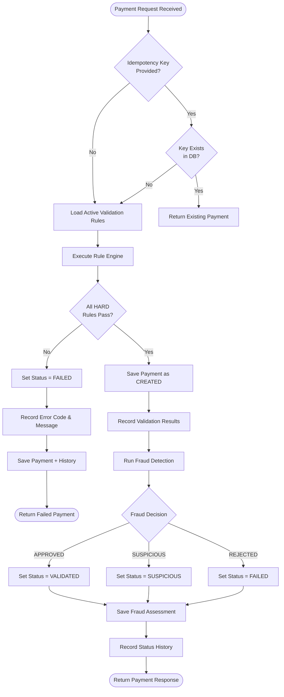
```mermaid
flowchart TD
    A([Payment Request Received]) --> B{Idempotency Key<br/>Provided?}
    
    B -->|Yes| C{Key Exists<br/>in DB?}
    B -->|No| D[Load Active Validation Rules]
    C -->|Yes| E[Return Existing Payment]
    C -->|No| D

    D --> F[Execute Rule Engine]
    F --> G{All HARD<br/>Rules Pass?}
    
    G -->|No| H[Set Status = FAILED]
    H --> I[Record Error Code & Message]
    I --> J[Save Payment + History]
    J --> K([Return Failed Payment])

    G -->|Yes| L[Save Payment as CREATED]
    L --> M[Record Validation Results]
    M --> N[Run Fraud Detection]
    
    N --> O{Fraud Decision}
    O -->|APPROVED| P[Set Status = VALIDATED]
    O -->|SUSPICIOUS| Q[Set Status = SUSPICIOUS]
    O -->|REJECTED| R[Set Status = FAILED]

    P --> S[Save Fraud Assessment]
    Q --> S
    R --> S
    S --> T[Record Status History]
    T --> U([Return Payment Response])
```

### 2. Fraud Scoring Activity

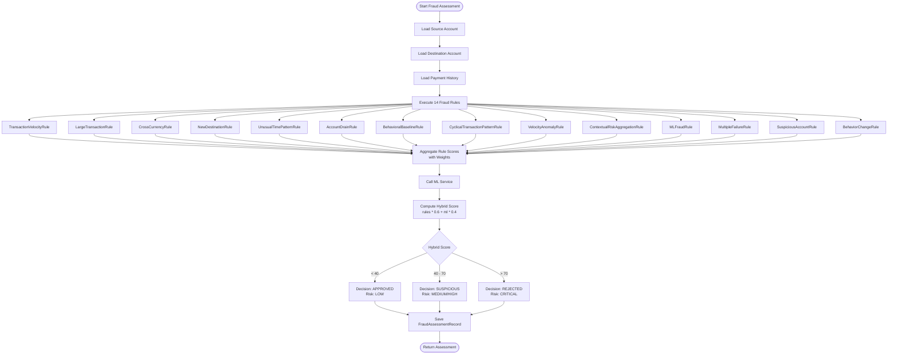
```mermaid
flowchart TD
    A([Start Fraud Assessment]) --> B[Load Source Account]
    B --> C[Load Destination Account]
    C --> D[Load Payment History]

    D --> E[Execute 14 Fraud Rules]
    
    E --> F1[TransactionVelocityRule]
    E --> F2[LargeTransactionRule]
    E --> F3[CrossCurrencyRule]
    E --> F4[NewDestinationRule]
    E --> F5[UnusualTimePatternRule]
    E --> F6[AccountDrainRule]
    E --> F7[BehavioralBaselineRule]
    E --> F8[CyclicalTransactionPatternRule]
    E --> F9[VelocityAnomalyRule]
    E --> F10[ContextualRiskAggregationRule]
    E --> F11[MLFraudRule]
    E --> F12[MultipleFailureRule]
    E --> F13[SuspiciousAccountRule]
    E --> F14[BehaviorChangeRule]

    F1 & F2 & F3 & F4 & F5 & F6 & F7 & F8 & F9 & F10 & F11 & F12 & F13 & F14 --> G[Aggregate Rule Scores<br/>with Weights]
    
    G --> H[Call ML Service]
    H --> I[Compute Hybrid Score<br/>rules * 0.6 + ml * 0.4]

    I --> J{Hybrid Score}
    J -->|"< 40"| K[Decision: APPROVED<br/>Risk: LOW]
    J -->|"40 - 70"| L[Decision: SUSPICIOUS<br/>Risk: MEDIUM/HIGH]
    J -->|"> 70"| M[Decision: REJECTED<br/>Risk: CRITICAL]

    K --> N[Save FraudAssessmentRecord]
    L --> N
    M --> N
    N --> O([Return Assessment])
```

### 3. Bulk Payment Processing Activity

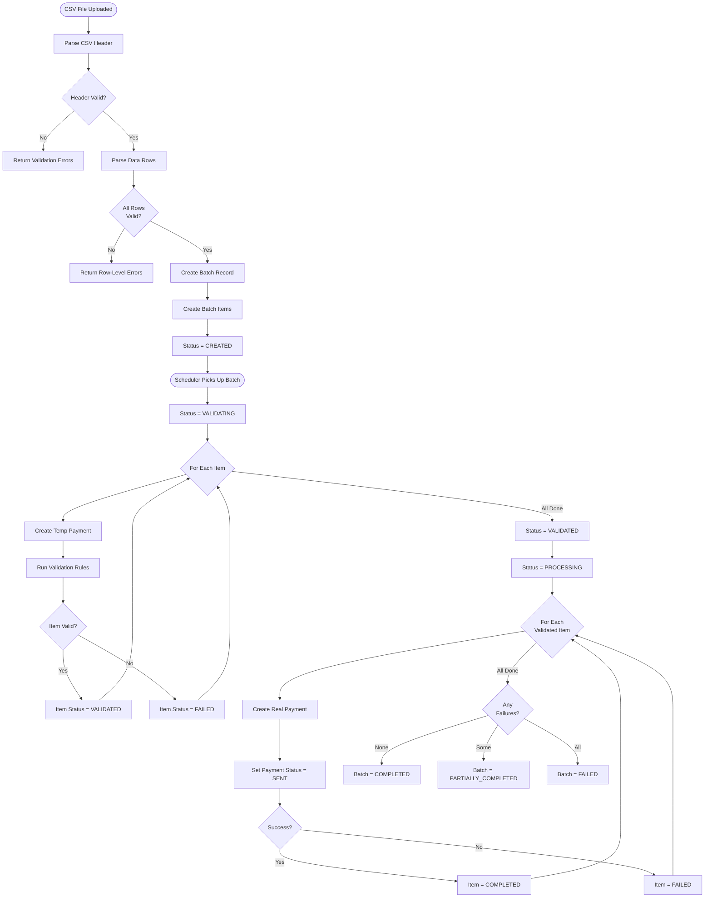
```mermaid
flowchart TD
    A([CSV File Uploaded]) --> B[Parse CSV Header]
    B --> C{Header Valid?}
    
    C -->|No| D[Return Validation Errors]
    C -->|Yes| E[Parse Data Rows]
    
    E --> F{All Rows<br/>Valid?}
    F -->|No| G[Return Row-Level Errors]
    F -->|Yes| H[Create Batch Record]
    
    H --> I[Create Batch Items]
    I --> J[Status = CREATED]

    J --> K([Scheduler Picks Up Batch])
    K --> L[Status = VALIDATING]
    
    L --> M{For Each Item}
    M --> N[Create Temp Payment]
    N --> O[Run Validation Rules]
    O --> P{Item Valid?}
    P -->|Yes| Q[Item Status = VALIDATED]
    P -->|No| R[Item Status = FAILED]
    Q --> M
    R --> M
    
    M -->|All Done| S[Status = VALIDATED]
    S --> T[Status = PROCESSING]

    T --> U{For Each<br/>Validated Item}
    U --> V[Create Real Payment]
    V --> W[Set Payment Status = SENT]
    W --> X{Success?}
    X -->|Yes| Y[Item = COMPLETED]
    X -->|No| Z[Item = FAILED]
    Y --> U
    Z --> U

    U -->|All Done| AA{Any<br/>Failures?}
    AA -->|None| AB[Batch = COMPLETED]
    AA -->|Some| AC[Batch = PARTIALLY_COMPLETED]
    AA -->|All| AD[Batch = FAILED]
```

---

## Component Diagram

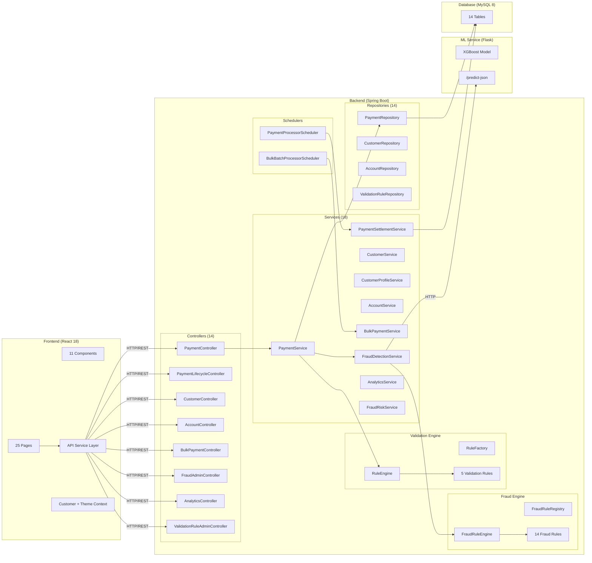
```mermaid
graph LR
    subgraph "Frontend (React 18)"
        Pages["25 Pages"]
        Components["11 Components"]
        Services["API Service Layer"]
        Context["Customer + Theme Context"]
    end

    subgraph "Backend (Spring Boot)"
        subgraph "Controllers (14)"
            PC["PaymentController"]
            PLC["PaymentLifecycleController"]
            CC["CustomerController"]
            AC["AccountController"]
            BC["BulkPaymentController"]
            FAC["FraudAdminController"]
            ANC["AnalyticsController"]
            VRC["ValidationRuleAdminController"]
        end

        subgraph "Services (18)"
            PS["PaymentService"]
            PSS["PaymentSettlementService"]
            CuS["CustomerService"]
            CPS["CustomerProfileService"]
            AcS["AccountService"]
            BPS["BulkPaymentService"]
            FDS["FraudDetectionService"]
            AnS["AnalyticsService"]
            FRS["FraudRiskService"]
        end

        subgraph "Fraud Engine"
            FRE["FraudRuleEngine"]
            FRR["FraudRuleRegistry"]
            Rules14["14 Fraud Rules"]
        end

        subgraph "Validation Engine"
            VRE["RuleEngine"]
            VRF["RuleFactory"]
            VRules["5 Validation Rules"]
        end

        subgraph "Repositories (14)"
            PR["PaymentRepository"]
            CR["CustomerRepository"]
            AR["AccountRepository"]
            VRR["ValidationRuleRepository"]
        end

        subgraph "Schedulers"
            PPS["PaymentProcessorScheduler"]
            BBPS["BulkBatchProcessorScheduler"]
        end
    end

    subgraph "ML Service (Flask)"
        XGB["XGBoost Model"]
        PredAPI["/predict-json"]
    end

    subgraph "Database (MySQL 8)"
        Tables["14 Tables"]
    end

    Pages --> Services
    Services -->|"HTTP/REST"| PC & PLC & CC & AC & BC & FAC & ANC & VRC
    PC --> PS
    PS --> FDS
    FDS --> FRE
    FRE --> Rules14
    FDS -->|"HTTP"| PredAPI
    PS --> VRE
    VRE --> VRules
    PS --> PR
    PR --> Tables
    PPS --> PSS
    PSS --> Tables
    BBPS --> BPS
```

---

## CI/CD Pipeline

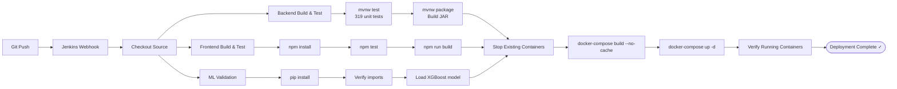
```mermaid
flowchart LR
    A[Git Push] --> B[Jenkins Webhook]
    B --> C[Checkout Source]
    
    C --> D[Backend Build & Test]
    D --> D1["mvnw test<br/>319 unit tests"]
    D1 --> D2["mvnw package<br/>Build JAR"]

    C --> E[Frontend Build & Test]
    E --> E1["npm install"]
    E1 --> E2["npm test"]
    E2 --> E3["npm run build"]

    C --> F[ML Validation]
    F --> F1["pip install"]
    F1 --> F2["Verify imports"]
    F2 --> F3["Load XGBoost model"]

    D2 & E3 & F3 --> G[Stop Existing Containers]
    G --> H["docker-compose build --no-cache"]
    H --> I["docker-compose up -d"]
    I --> J[Verify Running Containers]
    J --> K([Deployment Complete ✓])
```

---

## Deployment Architecture

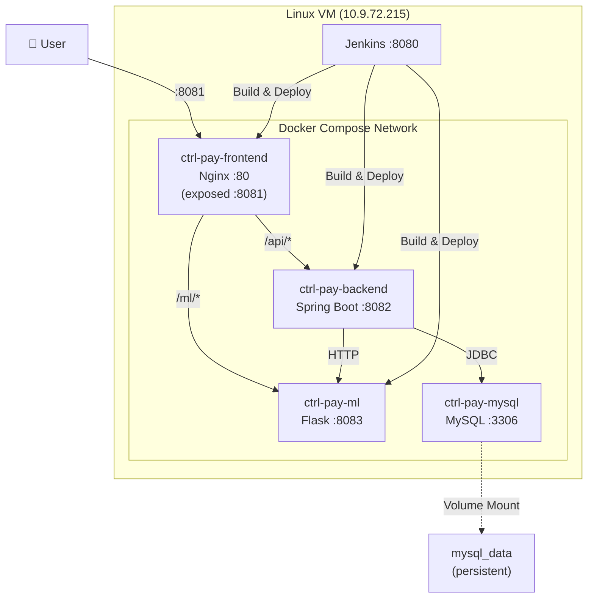
```mermaid
graph TB
    subgraph "Linux VM (10.9.72.215)"
        subgraph "Docker Compose Network"
            FE["ctrl-pay-frontend<br/>Nginx :80<br/>(exposed :8081)"]
            BE["ctrl-pay-backend<br/>Spring Boot :8082"]
            MLS["ctrl-pay-ml<br/>Flask :8083"]
            DB["ctrl-pay-mysql<br/>MySQL :3306"]
        end
        
        JK["Jenkins :8080"]
    end

    User["👤 User"] -->|":8081"| FE
    FE -->|"/api/*"| BE
    FE -->|"/ml/*"| MLS
    BE -->|"JDBC"| DB
    BE -->|"HTTP"| MLS
    JK -->|"Build & Deploy"| FE & BE & MLS

    DB -.->|"Volume Mount"| VOL["mysql_data<br/>(persistent)"]
```

### Health Check Chain

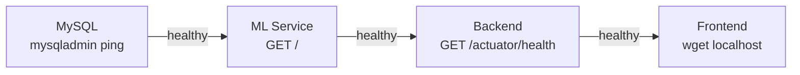
```mermaid
flowchart LR
    MySQL["MySQL<br/>mysqladmin ping"] -->|healthy| ML["ML Service<br/>GET /"] -->|healthy| Backend["Backend<br/>GET /actuator/health"] -->|healthy| Frontend["Frontend<br/>wget localhost"]
```

Services start in dependency order: MySQL → ML → Backend → Frontend. Each service waits for its dependencies to be healthy before starting.
